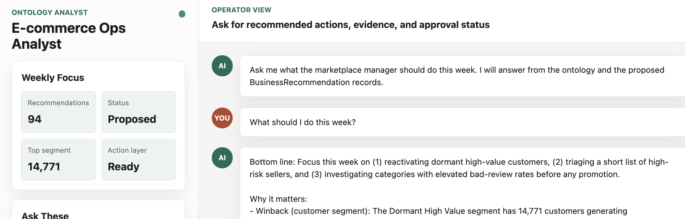
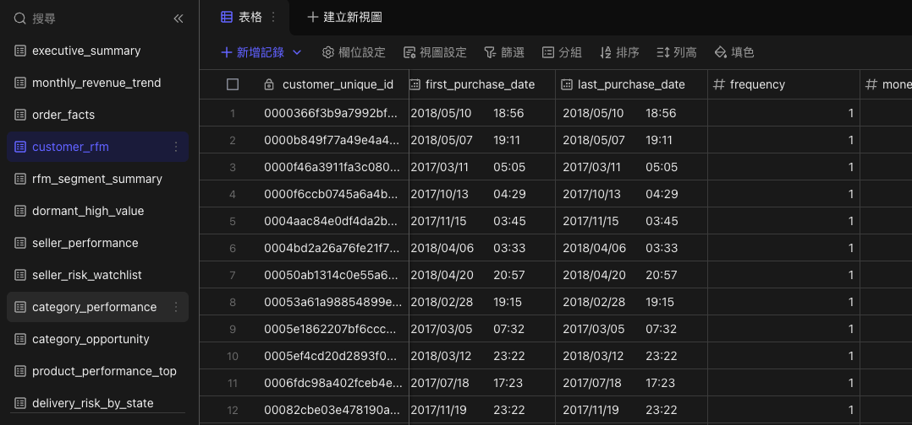

# AI E-commerce Ops Analyst

An AI-agent-operated e-commerce operations analyst demo that turns raw marketplace data into business objects, risk signals, and recommended actions.

This project simulates a Forward Deployed Engineer style engagement for a small e-commerce marketplace. It uses the Olist Brazilian E-Commerce Public Dataset as the raw operating data, builds a Lark Base-ready analysis layer, translates the business into a Palantir/AIP-inspired ontology, and exposes a local AI analyst UI that answers operator questions from recommendation records and action rules.

## Demo Preview

### AI Analyst Operator UI



The local web UI lets an operator ask for recommended actions, evidence, and approval status from the ontology and `BusinessRecommendation` records.

### Lark Base Analysis Layer



The analysis layer is staged in Lark Base-style tables and views, including customer RFM, seller risk, category performance, delivery risk, and recommendation records.

## What This Demo Shows

The demo answers practical operator questions:

- What should the marketplace manager do this week?
- Which dormant high-value customers should we try to win back?
- Which sellers create delivery or review risk?
- Which product categories should we promote or investigate?
- What evidence supports each recommendation?
- Which actions are only proposed and still need human approval?

The core idea is not "make another dashboard." The goal is to model the business world as objects, relationships, metrics, risks, and approved action types that an AI analyst can reason over.

```text
Raw Olist CSV data
  -> Lark-ready analysis workbooks and views
  -> ontology objects, links, metrics, and action rules
  -> BusinessRecommendation records
  -> local AI analyst web UI
```

## Current Features

- Raw Olist marketplace dataset in `dataset/`
- Lark Base import staging workbooks in `outputs/lark_import_staging/`
- Analysis-layer scripts for customer, seller, product, delivery, and review signals
- Draft ontology definitions for business objects, links, and actions
- Generated `BusinessRecommendation` records with priority, target object, evidence, and approval status
- Weekly operations brief summarizing top recommended actions
- Local web UI that calls the OpenAI Responses API and answers from the ontology/action context
- Local Palantir/AIP learning wiki and e-commerce ontology translation notes

## Repository Structure

```text
agent/
  AI analyst behavior and system prompt

dataset/
  Olist Brazilian E-Commerce Public Dataset CSV files

ontology/
  Machine-readable business objects, links, and action definitions

outputs/
  Dataset schema, AIP analysis blueprint, Lark staging files, and recommendation outputs

scripts/
  Local builders for analysis workbooks, dashboards, recommendation records, and Lark publishing

webui/
  Local Python server and static chat UI for the AI analyst demo

wiki/
  Palantir/AIP reference notes and project-specific ontology design guide
```

## Key Demo Artifacts

- `outputs/business_recommendations/WEEKLY_OPS_BRIEF.md` - human-readable weekly operating recommendations
- `outputs/business_recommendations/BUSINESS_RECOMMENDATIONS.md` - generated recommendation catalog
- `outputs/business_recommendations/business_recommendations.csv` - structured action-layer records
- `outputs/AI_ANALYST_DEMO_QA.md` - sample demo questions and expected answer behavior
- `ontology/actions.yml` - approved action types and guardrails
- `ontology/objects.yml` - business and analytical object model
- `ontology/links.yml` - relationships between object types
- `webui/` - runnable local AI analyst UI

## Setup

Requires Python 3.10+.

```bash
python3 -m venv .venv
source .venv/bin/activate
pip install -r requirements.txt
```

The local web UI requires an OpenAI API key.

```bash
cp webui/.env.example webui/.env
```

Edit `webui/.env`:

```text
OPENAI_API_KEY=your_key_here
OPENAI_MODEL=gpt-5-mini
PORT=8787
```

## Run The AI Analyst UI

```bash
python3 webui/server.py
```

Open:

```text
http://127.0.0.1:8787
```

Try these demo questions:

- What should I do this week?
- Which sellers should I investigate first?
- Which customers should I win back?
- Which categories should I promote?
- Why did you recommend seller `1ca7077d890b907f89be8c954a02686a`?
- Can you execute these actions?

The UI loads local context from the analyst prompt, ontology YAML files, governance notes, weekly brief, and `BusinessRecommendation` records. It does not send the API key to the browser.

## Rebuild Analysis Outputs

Build the Lark raw-table import workbook:

```bash
python3 scripts/build_lark_import_workbook.py
```

Build the Lark-ready analysis workbook:

```bash
python3 scripts/build_lark_analysis_workbook.py
```

Build the business recommendation action layer:

```bash
python3 scripts/build_business_recommendations.py
```

The recommendation builder generates:

- `outputs/business_recommendations/business_recommendations.csv`
- `outputs/business_recommendations/BUSINESS_RECOMMENDATIONS.md`
- `outputs/business_recommendations/business_recommendations_lark_batch.json`
- `outputs/business_recommendations/WEEKLY_OPS_BRIEF.md`

## Lark Base Workflow

The intended operating workflow is:

1. Import raw source tables or generated analysis workbooks into Lark Base.
2. Use Lark views to inspect customer RFM, seller risk, category performance, delivery risk, review dissatisfaction, and Pareto revenue signals.
3. Convert high-signal analytical findings into `BusinessRecommendation` records.
4. Let the AI analyst answer from those records and the ontology/action rules.
5. Keep every operational action in `proposed` status until a human operator approves it.

The project includes `scripts/publish_business_recommendations_to_lark.py` for publishing recommendation records to a Lark Base table when Lark CLI credentials and destination IDs are configured.

## Ontology And Action Model

The ontology layer defines business objects such as:

- `Customer`
- `Order`
- `Product`
- `Seller`
- `Review`
- `Delivery`
- `CustomerSegment`
- `SellerRisk`
- `DeliveryRisk`
- `ReviewRisk`
- `BusinessRecommendation`

Action types include:

- `CreateCustomerWinbackCampaign`
- `SendReactivationOffer`
- `InvestigateSeller`
- `DeprioritizeRiskySeller`
- `MonitorDeliveryRisk`
- `InvestigateLowReviewProductCategory`
- `PromoteHighRevenueCategory`

The AI analyst is designed to recommend and explain actions, not claim that real-world actions were executed.

## Data Source

This project uses the Olist Brazilian E-Commerce Public Dataset. The dataset contains anonymized marketplace data for orders, customers, sellers, products, payments, reviews, delivery timestamps, and geography.

If you reuse or publish this project, keep the dataset attribution and confirm the dataset license terms from the original Olist/Kaggle source.

## Notes

- `webui/.env` is intentionally ignored because it can contain secrets.
- Generated cache files such as `__pycache__/` and `.DS_Store` are ignored.
- The included CSV and XLSX files are large enough that a fresh clone may take some time, but no single file is over GitHub's 100 MB file limit.
