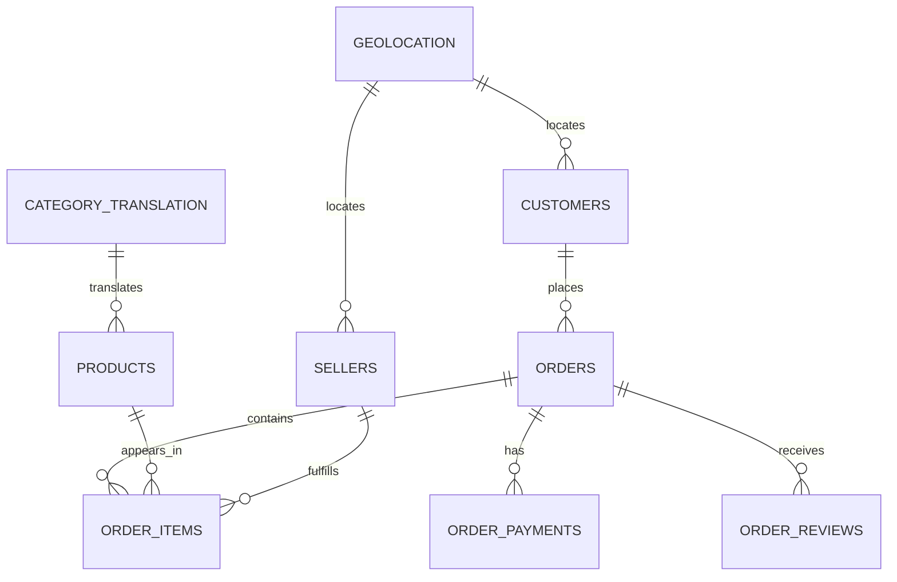

# Olist E-commerce Dataset Schema and Ontology Report

This report profiles the local Olist Brazilian E-Commerce Public Dataset and frames it as a small e-commerce operational ontology.

## Dataset Tables

| Table | Rows | Columns | Ontology Object | Key Candidates | Description |
|---|---:|---:|---|---|---|
| `customers` | 99441 | 5 | `Customer` | `customer_id` | Customer identity and customer location attributes. customer_id is order-facing; customer_unique_id groups repeat buyers. |
| `geolocation` | 1000163 | 5 | `Geography` | `` | Brazilian zip-code prefix geolocation reference data used to enrich customer and seller locations. |
| `order_items` | 112650 | 7 | `OrderItem` | `order_id + order_item_id` | Line-item level order facts, including product, seller, price, freight value, and shipping limit date. |
| `order_payments` | 103886 | 5 | `Payment` | `order_id + payment_sequential` | Payment installments and payment amounts attached to orders. |
| `order_reviews` | 99224 | 7 | `Review` | `` | Customer review scores and optional comments attached to orders. |
| `orders` | 99441 | 8 | `Order` | `order_id, customer_id` | Order lifecycle timestamps and order status. |
| `products` | 32951 | 9 | `Product` | `product_id` | Product catalog attributes and product category names. |
| `sellers` | 3095 | 4 | `Seller` | `seller_id` | Seller identity and seller location attributes. |
| `category_translation` | 71 | 2 | `ProductCategory` | `product_category_name, product_category_name_english` | Portuguese to English product category name mapping. |

## Inferred Relationships

| Relationship | From | To | Match % | Cardinality |
|---|---|---|---:|---|
| Order placed by Customer | `orders.customer_id` | `customers.customer_id` | 100.0% | many-to-one |
| Order contains OrderItem | `order_items.order_id` | `orders.order_id` | 100.0% | many-to-one |
| Order has Payment | `order_payments.order_id` | `orders.order_id` | 100.0% | many-to-one |
| Order received Review | `order_reviews.order_id` | `orders.order_id` | 100.0% | many-to-one |
| OrderItem references Product | `order_items.product_id` | `products.product_id` | 100.0% | many-to-one |
| OrderItem fulfilled by Seller | `order_items.seller_id` | `sellers.seller_id` | 100.0% | many-to-one |
| Product belongs to translated ProductCategory | `products.product_category_name` | `category_translation.product_category_name` | 99.96% | many-to-one |
| Customer location maps to Geography by zip prefix | `customers.customer_zip_code_prefix` | `geolocation.geolocation_zip_code_prefix` | 99.72% | many-to-many or reference-to-nonunique |
| Seller location maps to Geography by zip prefix | `sellers.seller_zip_code_prefix` | `geolocation.geolocation_zip_code_prefix` | 99.77% | many-to-many or reference-to-nonunique |

## Relationship Graph

## Ontology Interpretation

The raw CSVs can be mapped into business objects that an operator or AI agent can reason over:

- `Customer` from `customers, orders, order_payments, order_reviews`; key: `customers.customer_id; customers.customer_unique_id for real customer identity`; links: placed Orders; belongs to CustomerSegment; has RetentionOpportunity.
- `Order` from `orders, order_items, order_payments, order_reviews`; key: `orders.order_id`; links: placed by Customer; contains OrderItems; has Payment; received Review; has DeliveryRisk.
- `OrderItem` from `order_items`; key: `order_id + order_item_id`; links: references Product; fulfilled by Seller; belongs to Order.
- `Product` from `products, order_items, category_translation`; key: `products.product_id`; links: belongs to ProductCategory; appears in OrderItems; has ProductOpportunity.
- `ProductCategory` from `products, category_translation`; key: `product_category_name`; links: contains Products; has ProductOpportunity.
- `Seller` from `sellers, order_items, orders, order_reviews`; key: `sellers.seller_id`; links: fulfilled OrderItems; has SellerRisk.
- `Payment` from `order_payments`; key: `order_id + payment_sequential`; links: belongs to Order.
- `Review` from `order_reviews`; key: `review_id`; links: attached to Order; creates ReviewRisk.
- `Delivery` from `orders, order_items, geolocation`; key: `orders.order_id`; links: belongs to Order; creates DeliveryRisk.
- `BusinessRecommendation` from `derived from all analytical objects`; key: `recommendation_id`; links: targets Customer, Seller, Product, Category, or Order.

## Field Inventory

### `customers`

| Field | Type | Semantic Type | Null % | Unique Count | Samples |
|---|---|---|---:|---:|---|
| `customer_id` | `object` | `identifier` | 0.0 | 99441 | 06b8999e2fba1a1fbc88172c00ba8bc7, 18955e83d337fd6b2def6b18a428ac77, 4e7b3e00288586ebd08712fdd0374a03, b2b6027bc5c5109e529d4dc6358b12c3 |
| `customer_unique_id` | `object` | `identifier` | 0.0 | 96096 | 861eff4711a542e4b93843c6dd7febb0, 290c77bc529b7ac935b93aa66c333dc3, 060e732b5b29e8181a18229c7b0b2b5e, 259dac757896d24d7702b9acbbff3f3c |
| `customer_zip_code_prefix` | `int64` | `geo_key` | 0.0 | 14994 | 14409, 9790, 1151, 8775 |
| `customer_city` | `object` | `category` | 0.0 | 4119 | franca, sao bernardo do campo, sao paulo, mogi das cruzes |
| `customer_state` | `object` | `category` | 0.0 | 27 | SP, SC, MG, PR |

### `geolocation`

| Field | Type | Semantic Type | Null % | Unique Count | Samples |
|---|---|---|---:|---:|---|
| `geolocation_zip_code_prefix` | `int64` | `geo_key` | 0.0 | 19015 | 1037, 1046, 1041, 1035 |
| `geolocation_lat` | `float64` | `number` | 0.0 | 717363 | -23.54562128115268, -23.546081127035535, -23.54612896641469, -23.5443921648681 |
| `geolocation_lng` | `float64` | `number` | 0.0 | 717615 | -46.63929204800168, -46.64482029837157, -46.64295148361138, -46.63949930627844 |
| `geolocation_city` | `object` | `category` | 0.0 | 8011 | sao paulo, são paulo, sao bernardo do campo, jundiaí |
| `geolocation_state` | `object` | `category` | 0.0 | 27 | SP, RN, AC, RJ |

### `order_items`

| Field | Type | Semantic Type | Null % | Unique Count | Samples |
|---|---|---|---:|---:|---|
| `order_id` | `object` | `identifier` | 0.0 | 98666 | 00010242fe8c5a6d1ba2dd792cb16214, 00018f77f2f0320c557190d7a144bdd3, 000229ec398224ef6ca0657da4fc703e, 00024acbcdf0a6daa1e931b038114c75 |
| `order_item_id` | `int64` | `identifier` | 0.0 | 21 | 1, 2, 3, 4 |
| `product_id` | `object` | `identifier` | 0.0 | 32951 | 4244733e06e7ecb4970a6e2683c13e61, e5f2d52b802189ee658865ca93d83a8f, c777355d18b72b67abbeef9df44fd0fd, 7634da152a4610f1595efa32f14722fc |
| `seller_id` | `object` | `identifier` | 0.0 | 3095 | 48436dade18ac8b2bce089ec2a041202, dd7ddc04e1b6c2c614352b383efe2d36, 5b51032eddd242adc84c38acab88f23d, 9d7a1d34a5052409006425275ba1c2b4 |
| `shipping_limit_date` | `object` | `datetime` | 0.0 | 93318 | 2017-09-19 09:45:35, 2017-05-03 11:05:13, 2018-01-18 14:48:30, 2018-08-15 10:10:18 |
| `price` | `float64` | `money_or_amount` | 0.0 | 5968 | 58.9, 239.9, 199.0, 12.99 |
| `freight_value` | `float64` | `money_or_amount` | 0.0 | 6999 | 13.29, 19.93, 17.87, 12.79 |

### `order_payments`

| Field | Type | Semantic Type | Null % | Unique Count | Samples |
|---|---|---|---:|---:|---|
| `order_id` | `object` | `identifier` | 0.0 | 99440 | b81ef226f3fe1789b1e8b2acac839d17, a9810da82917af2d9aefd1278f1dcfa0, 25e8ea4e93396b6fa0d3dd708e76c1bd, ba78997921bbcdc1373bb41e913ab953 |
| `payment_sequential` | `int64` | `money_or_amount` | 0.0 | 29 | 1, 2, 4, 5 |
| `payment_type` | `object` | `money_or_amount` | 0.0 | 5 | credit_card, boleto, voucher, debit_card |
| `payment_installments` | `int64` | `money_or_amount` | 0.0 | 24 | 8, 1, 2, 3 |
| `payment_value` | `float64` | `money_or_amount` | 0.0 | 29077 | 99.33, 24.39, 65.71, 107.78 |

### `order_reviews`

| Field | Type | Semantic Type | Null % | Unique Count | Samples |
|---|---|---|---:|---:|---|
| `review_id` | `object` | `identifier` | 0.0 | 98410 | 7bc2406110b926393aa56f80a40eba40, 80e641a11e56f04c1ad469d5645fdfde, 228ce5500dc1d8e020d8d1322874b6f0, e64fb393e7b32834bb789ff8bb30750e |
| `order_id` | `object` | `identifier` | 0.0 | 98673 | 73fc7af87114b39712e6da79b0a377eb, a548910a1c6147796b98fdf73dbeba33, f9e4b658b201a9f2ecdecbb34bed034b, 658677c97b385a9be170737859d3511b |
| `review_score` | `int64` | `score` | 0.0 | 5 | 4, 5, 1, 3 |
| `review_comment_title` | `object` | `text` | 88.34 | 4527 | recomendo, Super recomendo, Não chegou meu produto , Ótimo |
| `review_comment_message` | `object` | `text` | 58.7 | 36159 | Recebi bem antes do prazo estipulado., Parabéns lojas lannister adorei comprar pela Internet seguro e prát..., aparelho eficiente. no site a marca do aparelho esta impresso como ..., Mas um pouco ,travando...pelo valor ta Boa.
 |
| `review_creation_date` | `object` | `datetime` | 0.0 | 636 | 2018-01-18 00:00:00, 2018-03-10 00:00:00, 2018-02-17 00:00:00, 2017-04-21 00:00:00 |
| `review_answer_timestamp` | `object` | `datetime` | 0.0 | 98248 | 2018-01-18 21:46:59, 2018-03-11 03:05:13, 2018-02-18 14:36:24, 2017-04-21 22:02:06 |

### `orders`

| Field | Type | Semantic Type | Null % | Unique Count | Samples |
|---|---|---|---:|---:|---|
| `order_id` | `object` | `identifier` | 0.0 | 99441 | e481f51cbdc54678b7cc49136f2d6af7, 53cdb2fc8bc7dce0b6741e2150273451, 47770eb9100c2d0c44946d9cf07ec65d, 949d5b44dbf5de918fe9c16f97b45f8a |
| `customer_id` | `object` | `identifier` | 0.0 | 99441 | 9ef432eb6251297304e76186b10a928d, b0830fb4747a6c6d20dea0b8c802d7ef, 41ce2a54c0b03bf3443c3d931a367089, f88197465ea7920adcdbec7375364d82 |
| `order_status` | `object` | `category` | 0.0 | 8 | delivered, invoiced, shipped, processing |
| `order_purchase_timestamp` | `object` | `datetime` | 0.0 | 98875 | 2017-10-02 10:56:33, 2018-07-24 20:41:37, 2018-08-08 08:38:49, 2017-11-18 19:28:06 |
| `order_approved_at` | `object` | `datetime` | 0.16 | 90733 | 2017-10-02 11:07:15, 2018-07-26 03:24:27, 2018-08-08 08:55:23, 2017-11-18 19:45:59 |
| `order_delivered_carrier_date` | `object` | `datetime` | 1.79 | 81018 | 2017-10-04 19:55:00, 2018-07-26 14:31:00, 2018-08-08 13:50:00, 2017-11-22 13:39:59 |
| `order_delivered_customer_date` | `object` | `datetime` | 2.98 | 95664 | 2017-10-10 21:25:13, 2018-08-07 15:27:45, 2018-08-17 18:06:29, 2017-12-02 00:28:42 |
| `order_estimated_delivery_date` | `object` | `datetime` | 0.0 | 459 | 2017-10-18 00:00:00, 2018-08-13 00:00:00, 2018-09-04 00:00:00, 2017-12-15 00:00:00 |

### `products`

| Field | Type | Semantic Type | Null % | Unique Count | Samples |
|---|---|---|---:|---:|---|
| `product_id` | `object` | `identifier` | 0.0 | 32951 | 1e9e8ef04dbcff4541ed26657ea517e5, 3aa071139cb16b67ca9e5dea641aaa2f, 96bd76ec8810374ed1b65e291975717f, cef67bcfe19066a932b7673e239eb23d |
| `product_category_name` | `object` | `category` | 1.85 | 73 | perfumaria, artes, esporte_lazer, bebes |
| `product_name_lenght` | `float64` | `number` | 1.85 | 66 | 40.0, 44.0, 46.0, 27.0 |
| `product_description_lenght` | `float64` | `number` | 1.85 | 2960 | 287.0, 276.0, 250.0, 261.0 |
| `product_photos_qty` | `float64` | `number` | 1.85 | 19 | 1.0, 4.0, 2.0, 3.0 |
| `product_weight_g` | `float64` | `number` | 0.01 | 2204 | 225.0, 1000.0, 154.0, 371.0 |
| `product_length_cm` | `float64` | `number` | 0.01 | 99 | 16.0, 30.0, 18.0, 26.0 |
| `product_height_cm` | `float64` | `number` | 0.01 | 102 | 10.0, 18.0, 9.0, 4.0 |
| `product_width_cm` | `float64` | `number` | 0.01 | 95 | 14.0, 20.0, 15.0, 26.0 |

### `sellers`

| Field | Type | Semantic Type | Null % | Unique Count | Samples |
|---|---|---|---:|---:|---|
| `seller_id` | `object` | `identifier` | 0.0 | 3095 | 3442f8959a84dea7ee197c632cb2df15, d1b65fc7debc3361ea86b5f14c68d2e2, ce3ad9de960102d0677a81f5d0bb7b2d, c0f3eea2e14555b6faeea3dd58c1b1c3 |
| `seller_zip_code_prefix` | `int64` | `geo_key` | 0.0 | 2246 | 13023, 13844, 20031, 4195 |
| `seller_city` | `object` | `category` | 0.0 | 611 | campinas, mogi guacu, rio de janeiro, sao paulo |
| `seller_state` | `object` | `category` | 0.0 | 23 | SP, RJ, PE, PR |

### `category_translation`

| Field | Type | Semantic Type | Null % | Unique Count | Samples |
|---|---|---|---:|---:|---|
| `product_category_name` | `object` | `category` | 0.0 | 71 | beleza_saude, informatica_acessorios, automotivo, cama_mesa_banho |
| `product_category_name_english` | `object` | `category` | 0.0 | 71 | health_beauty, computers_accessories, auto, bed_bath_table |

## First Metrics to Build

- `Total revenue` (business/order/seller/category): Understand revenue size and revenue concentration.
- `Average order value` (order/customer): Identify high-value customers and order patterns.
- `RFM segment` (customer): Segment loyal, new, at-risk, and dormant customers.
- `Churn risk score` (customer): Find high-value inactive customers for winback.
- `Delivery delay days` (order): Detect late delivery and operational risk.
- `Late delivery rate` (seller/category): Rank sellers/categories by fulfillment risk.
- `Review dissatisfaction rate` (seller/product/category): Find quality, delivery, or expectation problems.
- `Seller reliability score` (seller): Prioritize, monitor, or deprioritize sellers.

## First Action Types

- `SendReactivationOffer` targeting `Customer`: trigger = High historical value and long inactivity
- `PrioritizeHighValueCustomer` targeting `Customer`: trigger = High lifetime value or strong recent purchase pattern
- `InvestigateSeller` targeting `Seller`: trigger = High late delivery rate or low average review score
- `DeprioritizeRiskySeller` targeting `Seller`: trigger = Persistent seller risk despite meaningful order volume
- `InvestigateLowReviewProduct` targeting `Product`: trigger = Strong sales but poor review score
- `FixDeliveryProcess` targeting `DeliveryRisk`: trigger = Late delivery cluster by seller, city, state, or category
- `PromoteHighRevenueCategory` targeting `ProductCategory`: trigger = High revenue share and acceptable review/delivery performance

## Generated Artifacts

- Excel catalog for Lark Base import: `outputs/olist_ecommerce_ontology_schema_catalog.xlsx`
- JSON profile: `outputs/olist_dataset_profile.json`
